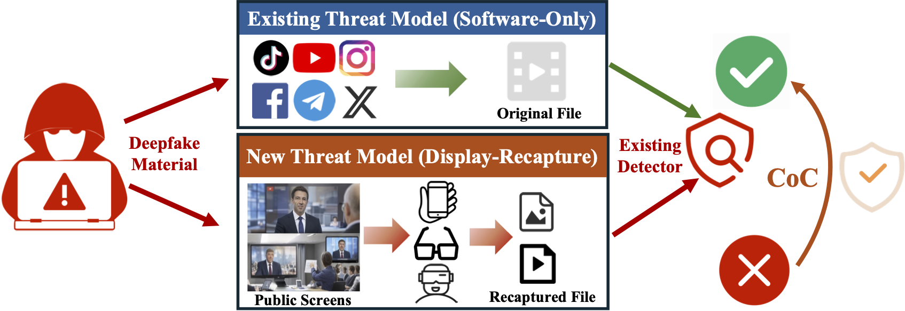

# ScreenDeepfakeBench

Official benchmark repository for the RAID 2026 paper:

> **Caught on Camera: Toward Evaluating and Defending On-Screen Deepfakes With Mobile and Wearable Camera Devices**  
> Shuhao Zhang, Pai Zheng, Yuanzhe Yang, Qinhong Jiang, and Yan Long  
> The 29th International Symposium on Research in Attacks, Intrusions and Defenses (RAID 2026)

## Overview

<p align="center">
  
</p>

<p align="center">
  <em>Comparison between conventional digital-domain detection and
  display-recapture deepfake detection.</em>
</p>

ScreenDeepfakeBench is a benchmark for evaluating and improving deepfake
detectors under physical display-recapture conditions.

Existing deepfake detectors are commonly evaluated on original digital media.
In practical user-side verification scenarios, however, suspicious content may
first be displayed on a physical screen and then recaptured using a smartphone
or smart-glasses camera. This process introduces resolution loss, geometric
distortion, reflections, photometric and camera-processing shifts, and
structured Moire interference.

The benchmark accompanies our Caught-on-Camera (CoC) study and supports
research on:

- On-screen deepfake detection
- Physical display-recapture robustness
- Deepfake detector evaluation and calibration
- Explainability of successful and failed detections
- Recapture-aware training and fine-tuning
- Cross-device and cross-display generalization

## Benchmark Summary

ScreenDeepfakeBench contains 29,900 real and fake samples collected under
103 display-recapture configurations:

- 14,950 real samples
- 14,950 fake samples
- 19 controlled single-factor configurations
- 84 natural multi-factor configurations
- 4 camera devices
- 6 display devices

The controlled configurations examine capture distance, viewing angle,
ambient lighting, and Moire interference. The multi-factor configurations
cover natural combinations of display, camera, geometry, lighting,
reflection, and device-side image processing.

Capture devices include:

- iPhone 17 Pro
- Vivo V21
- Meta Wayfarer
- Rokid glasses

Display devices include Redmi, AOC, MAXHUB 55-inch, MAXHUB 86-inch,
STARZEN, and SEEWO displays.

## Release Status

This repository currently serves as a preview of ScreenDeepfakeBench.

The complete benchmark is being organized and documented. The full release
is planned following the conclusion of RAID 2026 and will include the dataset,
metadata and evaluation splits, preprocessing and evaluation code, baseline
detector configurations, CoC training and fine-tuning resources, and
reproducibility documentation.

Repository contents and documentation may be updated before the complete
release.

## Early Access

Researchers who would like to access the dataset before the complete public
release may contact:

**Shuhao**  
[szhang515@connect.hkust-gz.edu.cn](mailto:szhang515@connect.hkust-gz.edu.cn)

Please briefly describe your affiliation and intended research use in the
request.

## Citation

If you use ScreenDeepfakeBench, please cite:

```bibtex
@inproceedings{zhang2026caught,
  title     = {Caught on Camera: Toward Evaluating and Defending On-Screen
               Deepfakes With Mobile and Wearable Camera Devices},
  author    = {Zhang, Shuhao and Zheng, Pai and Yang, Yuanzhe and
               Jiang, Qinhong and Long, Yan},
  booktitle = {Proceedings of the 29th International Symposium on Research
               in Attacks, Intrusions and Defenses (RAID)},
  year      = {2026}
}
