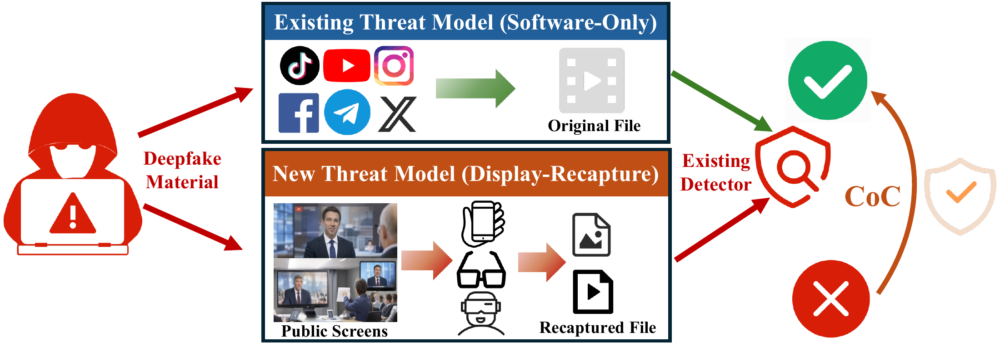

# ScreenDeepfakeBench

Official code and benchmark resources for **Caught on Camera: Toward Evaluating
and Defending On-Screen Deepfakes With Mobile and Wearable Camera Devices**,
RAID 2026.

**Shuhao Zhang, Pai Zheng, Yuanzhe Yang, Qinhong Jiang, and Yan Long**

[Dataset and resources](https://doi.org/10.5281/zenodo.21790607) |
[Data preparation](docs/DATA.md) | [Training and fine-tuning](docs/TRAINING.md)

## Overview



ScreenDeepfakeBench studies deepfake detection when content displayed on a
physical screen is recaptured with a smartphone or smart-glasses camera.
Display recapture introduces resolution loss, geometric distortion, reflections,
photometric and camera-processing shifts, and Moire interference.

Caught-on-Camera (CoC) improves Xception robustness using selective training-time
augmentation. It does not require physically recaptured training images. This
repository includes the original Xception, FFD and SPSL detectors, the CoC
pipeline, and commands for evaluation, training and fine-tuning.

## Dataset

| Property | Coverage |
| --- | --- |
| Detector inputs | 29,900 images: 14,950 real and 14,950 fake |
| Recapture configurations | 103: 19 controlled and 84 multi-factor |
| Controlled factors | Distance, viewing angle, ambient lighting, Moire |
| Cameras | iPhone 17 Pro, Vivo V21, Meta Wayfarer, Rokid glasses |
| Displays | Redmi, AOC, MAXHUB 55-inch, MAXHUB 86-inch, STARZEN, SEEWO |

The released images are the exact detector inputs, not real/fake image pairs.
Face detection succeeded for 29,691 images; 209 inputs retain the full captured
frame as the original fallback. These inputs remain part of the benchmark.
Full-resolution camera captures are available upon request from Shuhao Zhang.

## Installation

Python 3.9 and PyTorch 2.2.2 are the supported baseline. Training requires an
NVIDIA CUDA GPU; evaluation also supports CPU.

```bash
conda create -n screenbench python=3.9 -y
conda activate screenbench
pip install torch==2.2.2 torchvision==0.17.2 --index-url https://download.pytorch.org/whl/cu121
pip install -r requirements.txt
```

For CPU-only evaluation, install the CPU builds of the same PyTorch and
torchvision versions instead. Run the commands below from the repository root.

## Downloads

Download the files from the [Zenodo resource page](https://doi.org/10.5281/zenodo.21790607).
The current public [detector-input dataset](https://zenodo.org/records/23149435)
contains `CoC_Dataset_zenodo.zip`.

| File | Needed for |
| --- | --- |
| `CoC_Dataset_zenodo.zip` | Recaptured benchmark evaluation |
| `ScreenDeepfakeBench_models.zip` | Four paper checkpoints and ImageNet initialization |
| `Celeb-DF-v2-clean.zip` | Training and fine-tuning images |
| `ScreenDeepfakeBench_training_support.zip` | Training index and digital validation inputs/indexes |

```bash
unzip ScreenDeepfakeBench_models.zip -d .
mkdir -p data
unzip CoC_Dataset_zenodo.zip -d data
python scripts/check_resources.py --load-models
python scripts/prepare_data.py --data-root data/CoC_Dataset_zenodo
```

The resource checker verifies required files and optionally loads each detector.
The data-preparation command checks all 29,900 inputs and writes relative-path
indexes under `outputs/indexes/`. No development-archive paths are needed.

## Evaluate

Evaluate CoC or all four models:

```bash
python scripts/evaluate.py --model coc --data-root data/CoC_Dataset_zenodo
python scripts/evaluate.py --model all --data-root data/CoC_Dataset_zenodo --output outputs/all_models
python scripts/summarize.py --results outputs/all_models --output outputs/summary
```

Use `--group controlled` for the 19 single-factor configurations or
`--group multifactor` for the other 84. For CPU evaluation, add
`--device cpu --workers 0`. Use a new `--output` directory for each run.

```bash
python scripts/evaluate.py --model coc --group controlled \
  --data-root data/CoC_Dataset_zenodo --save-predictions --output outputs/coc_controlled
```

`--save-predictions` exports a file per configuration containing frame scores,
labels and image paths, suitable for success/failure analysis and explainability.
They can be read with `numpy.load(path, allow_pickle=False)`.

### Paper-Checkpoint Results

| Method | Frame ACC | Frame AUC | Video ACC | Video AUC |
| --- | ---: | ---: | ---: | ---: |
| Xception | 65.62% | 0.88986 | 65.22% | 0.92576 |
| FFD | 61.97% | 0.81405 | 60.80% | 0.86307 |
| SPSL | 83.65% | 0.95588 | 85.44% | 0.98162 |
| CoC (Xception) | 89.46% | 0.96542 | 91.83% | 0.98074 |

These are equal-weight averages across the **103 configurations**, not pooled
image accuracy. ACC uses a fixed `score > 0.5` threshold. Video predictions
average the five frame scores per source video within each configuration;
this is score averaging, not a temporal model. Device/display comparisons use
the 84 multi-factor configurations. Digital controls are excluded from these
recaptured headline metrics.

The summary command also reports per-camera and per-display averages over the
multi-factor configurations. It flags incomplete groups instead of presenting
partial runs as full benchmark results.

`reference_results/` contains the per-configuration paper reference values under
the public configuration names. The release focuses on the three baseline
detectors, controlled physical factors, and final CoC; augmentation sweeps,
composition searches and exploratory frequency variants are not included.

## Training and Fine-Tuning

Prepare the additional resources:

```bash
unzip ScreenDeepfakeBench_training_support.zip -d data
unzip Celeb-DF-v2-clean.zip -d data/training_data
python scripts/check_resources.py --training-root data/training_data
```

The digital controls can be evaluated separately; they are never included by
`--group all`:

```bash
python scripts/evaluate.py --model all --group digital \
  --data-root data/training_data --index-root data/training_data/indexes \
  --output outputs/digital_controls
```

Fine-tune the released CoC detector with a fresh optimizer:

```bash
python scripts/fine_tune.py --model coc --data-root data/training_data \
  --epochs 5 --lr 0.00002 --output outputs/coc_finetuned
```

Train from ImageNet initialization, without loading a paper detector checkpoint:

```bash
python scripts/train.py --model coc --data-root data/training_data \
  --epochs 11 --output outputs/coc_trained
```

Both commands also accept `--model xception`, `--model ffd` and `--model spsl`.
Training and fine-tuning are separate from evaluating the released paper weights;
their results depend on initialization, random sampling and the environment.
See [training details](docs/TRAINING.md) for selection, custom splits, deterministic
execution, and evaluating a new checkpoint. Do not fine-tune or select models on
the full recaptured benchmark and then report it as a held-out test.

## Code and License

Detector, backbone, training and metric components are adapted from
[DeepfakeBench](https://github.com/SCLBD/DeepfakeBench). Original attribution and
the upstream license are retained in [NOTICE.md](NOTICE.md) and [LICENSE](LICENSE).
Dataset and source-media terms are separate from the source-code license.

## Citation

```bibtex
@inproceedings{zhang2026caught,
  title={Caught on Camera: Toward Evaluating and Defending On-Screen Deepfakes With Mobile and Wearable Camera Devices},
  author={Zhang, Shuhao and Zheng, Pai and Yang, Yuanzhe and Jiang, Qinhong and Long, Yan},
  booktitle={Proceedings of the 29th International Symposium on Research in Attacks, Intrusions and Defenses (RAID)},
  year={2026}
}
```

Contact: **Shuhao Zhang**, szhang515@connect.hkust-gz.edu.cn.
